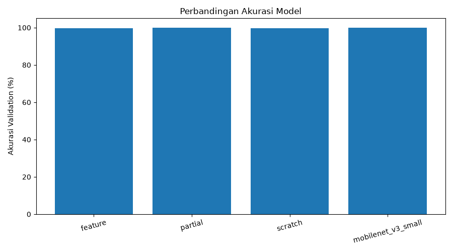
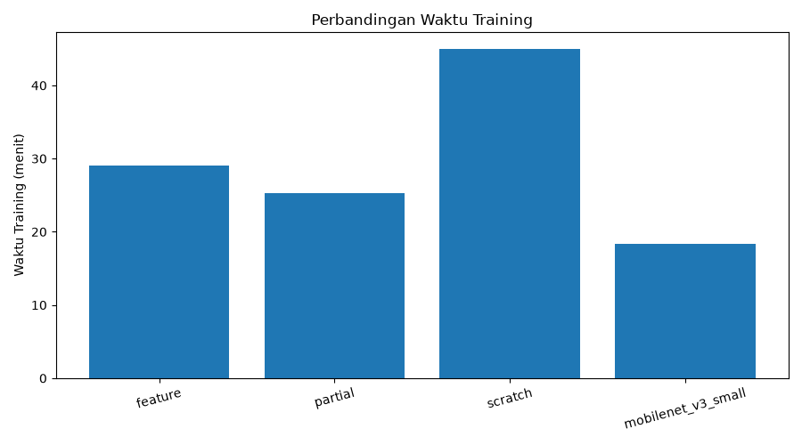
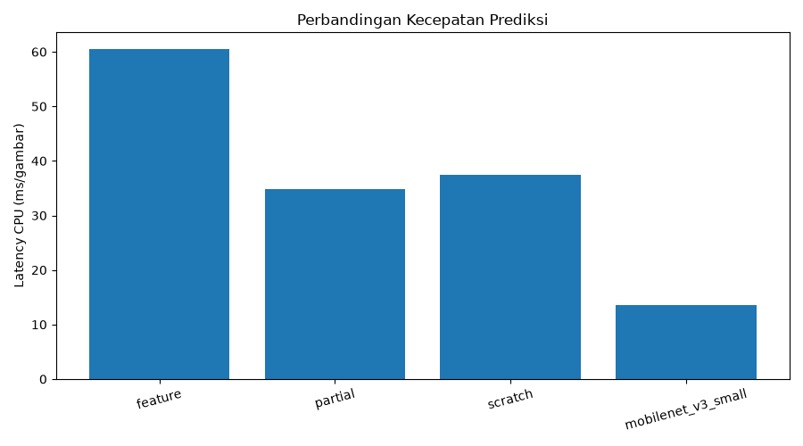
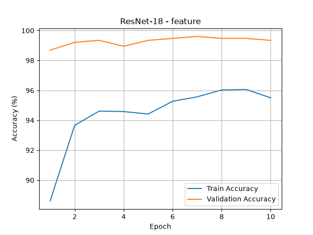
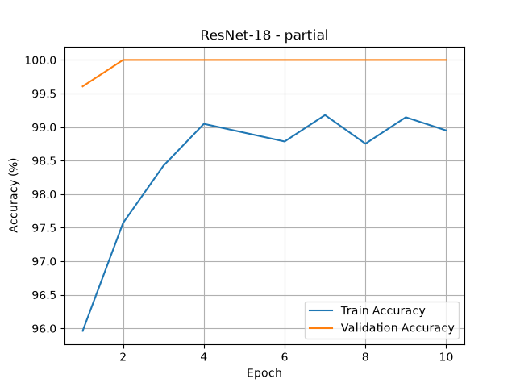
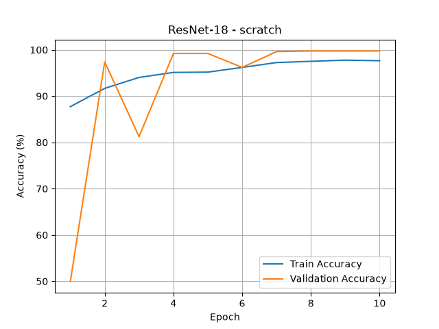

# Transfer Learning dan Fine-Tuning

## Klasifikasi Gambar Baut (Bolt) dan Mur (Nut)

## 1. Tujuan Proyek

Proyek ini bertujuan untuk membandingkan metode Transfer Learning dan Fine-Tuning menggunakan deep learning untuk mengklasifikasikan gambar baut dan mur.

Perbandingan dilakukan berdasarkan:

* Akurasi validation.
* Epoch terbaik.
* Waktu training.
* Latency CPU atau waktu prediksi per gambar.

Selain ResNet-18, proyek ini juga membandingkan performa MobileNetV3-Small.

## 2. Dataset

Dataset terdiri dari dua kelas gambar, yaitu baut dan mur.

| Kelas       | Jumlah Gambar |
| ----------- | ------------: |
| Baut (Bolt) |         1.904 |
| Mur (Nut)   |         1.904 |
| **Total**   |     **3.808** |

Pembagian dataset:

| Kelas     |  Training | Validation |
| --------- | --------: | ---------: |
| Baut      |     1.523 |        381 |
| Mur       |     1.523 |        381 |
| **Total** | **3.046** |    **762** |

Informasi gambar dicatat dalam file `dataset_raw/metadata.csv`, yang berisi:

* Nama file.
* Lokasi file.
* Label kelas.
* Lebar dan tinggi gambar.
* Format gambar.

**Catatan dataset:** Gambar yang digunakan berasal dari dataset gambar yang sudah tersedia, bukan hasil pengambilan langsung menggunakan kamera pada proyek ini. Pengujian menggunakan gambar baru dari kamera masih diperlukan.

## 3. Metode Pelatihan

### 3.1 ResNet-18 Feature Extraction

Menggunakan bobot pretrained dan hanya melatih layer klasifikasi. Metode ini memanfaatkan fitur yang sudah dipelajari dari dataset sebelumnya.

### 3.2 ResNet-18 Partial Fine-Tuning

Menggunakan bobot pretrained, kemudian melatih layer4 dan layer klasifikasi. Metode ini memungkinkan sebagian fitur model menyesuaikan diri dengan dataset baut dan mur.

### 3.3 ResNet-18 From Scratch

Melatih model dengan inisialisasi bobot acak tanpa menggunakan bobot pretrained.

### 3.4 MobileNetV3-Small

Menggunakan arsitektur MobileNetV3-Small sebagai pembanding untuk mengevaluasi akurasi dan kecepatan prediksi.

## 4. Hasil Perbandingan Model

| Model                         | Akurasi Validation | Epoch Terbaik | Waktu Training | Latency CPU |
| ----------------------------- | -----------------: | ------------: | -------------: | ----------: |
| ResNet-18 Feature Extraction  |             99,61% |             7 |    29,07 menit |    60,53 ms |
| ResNet-18 Partial Fine-Tuning |            100,00% |             2 |    25,27 menit |    34,78 ms |
| ResNet-18 From Scratch        |             99,74% |             8 |    45,00 menit |    37,47 ms |
| MobileNetV3-Small             |            100,00% |             2 |    18,41 menit |    13,60 ms |

Hasil tersebut menunjukkan bahwa ResNet-18 Partial Fine-Tuning dan MobileNetV3-Small memperoleh akurasi validation tertinggi sebesar 100% pada eksperimen ini.

MobileNetV3-Small memiliki waktu training dan latency CPU paling rendah di antara model yang diuji.

## 5. Grafik Perbandingan Model

### 5.1 Perbandingan Akurasi



### 5.2 Perbandingan Waktu Training



### 5.3 Perbandingan Latency



### 5.4 Grafik Training ResNet-18 Feature Extraction



### 5.5 Grafik Training ResNet-18 Partial Fine-Tuning



### 5.6 Grafik Training ResNet-18 From Scratch



## 6. Pengujian Prediksi

Model ResNet-18 Partial Fine-Tuning diuji menggunakan gambar dari masing-masing kelas.

| Gambar Uji  | Hasil Prediksi | Confidence |
| ----------- | -------------- | ---------: |
| Gambar baut | Baut           |     99,99% |
| Gambar mur  | Mur            |     99,07% |

Hasil pengujian menunjukkan bahwa model berhasil mengenali kedua kelas pada gambar uji tersebut. Confidence merupakan tingkat keyakinan prediksi model, bukan jaminan bahwa prediksi selalu benar pada gambar lain.

## 7. Analisis Hasil

ResNet-18 Partial Fine-Tuning memperoleh akurasi validation sebesar 100% dengan waktu training 25,27 menit dan latency CPU 34,78 ms per gambar.

ResNet-18 From Scratch membutuhkan waktu training paling lama, yaitu 45 menit. Hal ini menunjukkan bahwa penggunaan bobot pretrained dapat membantu mempercepat pelatihan dalam eksperimen ini.

MobileNetV3-Small memperoleh akurasi validation sebesar 100%, dengan waktu training 18,41 menit dan latency 13,60 ms per gambar. Berdasarkan hasil pengujian, MobileNetV3-Small lebih cepat untuk prediksi CPU.

Meskipun akurasi validation sangat tinggi, evaluasi menggunakan gambar baru dan kondisi pengambilan gambar yang berbeda masih diperlukan untuk mengukur kemampuan generalisasi model.

## 8. Struktur Proyek

```text
transfer_learning/
├── dataset_raw/
│   ├── baut/
│   ├── mur/
│   └── metadata.csv
├── dataset/
│   ├── train/
│   │   ├── baut/
│   │   └── mur/
│   └── val/
│       ├── baut/
│       └── mur/
├── results/
│   ├── accuracy_feature.png
│   ├── accuracy_partial.png
│   ├── accuracy_scratch.png
│   ├── comparison.csv
│   ├── comparison_accuracy.png
│   ├── comparison_training_time.png
│   ├── comparison_latency.png
│   ├── history_feature.csv
│   ├── history_partial.csv
│   ├── history_scratch.csv
│   ├── history_mobilenet.csv
│   ├── resnet18_feature.pth
│   ├── resnet18_partial.pth
│   ├── resnet18_scratch.pth
│   └── mobilenet_v3_small.pth
├── prepare_dataset.py
├── make_metadata.py
├── train_model.py
├── compare_mobilenet.py
├── compare_results.py
├── predict.py
├── DESAIN_PROYEK.md
└── README.md
```

## 9. Teknologi yang Digunakan

* Python
* PyTorch
* Torchvision
* ResNet-18
* MobileNetV3-Small
* Pandas
* Matplotlib
* Pillow

## 10. Cara Menjalankan Proyek

Menyiapkan dataset:

```powershell
python prepare_dataset.py
```

Membuat metadata:

```powershell
python make_metadata.py
```

Melatih ResNet-18:

```powershell
python train_model.py
```

Melatih MobileNetV3-Small:

```powershell
python compare_mobilenet.py
```

Membuat grafik perbandingan:

```powershell
python compare_results.py
```

Menguji prediksi:

```powershell
python predict.py
```

## 11. Kesimpulan

Proyek berhasil menerapkan metode Transfer Learning dan Fine-Tuning untuk klasifikasi gambar baut dan mur. Empat konfigurasi model telah dibandingkan berdasarkan akurasi validation, epoch terbaik, waktu training, dan latency CPU.

ResNet-18 Partial Fine-Tuning dan MobileNetV3-Small memperoleh akurasi validation tertinggi pada eksperimen ini. MobileNetV3-Small menunjukkan latency CPU paling rendah sehingga berpotensi menjadi pilihan untuk kebutuhan prediksi yang lebih cepat.

Pengujian menggunakan gambar baru dari kamera tetap diperlukan untuk memastikan performa model pada kondisi nyata.
